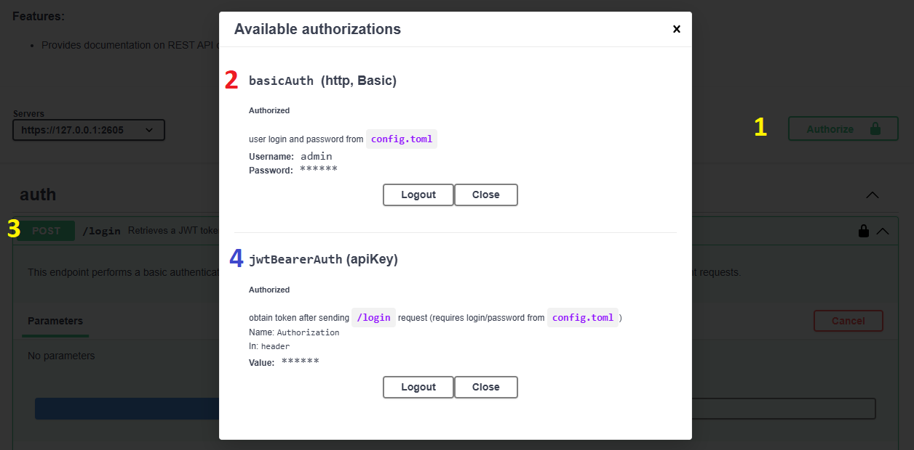

## About

Following file contains OpenAPI 3.0 spec for DareDB in `YAML` format -> [daredb-openapi_primary.yaml](daredb-openapi_primary.yaml)


## Render API: Using `redocly` (remote)

You can view API  OpenAPI 3.0 spec for DareDB using `redocly` -> [daredb-openapi_primary.yaml](https://redocly.github.io/redoc/?url=https://raw.githubusercontent.com/dmarro89/dare-db/refs/heads/main/openapi/daredb-openapi_primary.yaml)


## Render API: Self-Hosted (local)

You can render API directly locally using `docker compose`. Must be run in the directory `openapi`.

* Run with docker compose
	```bash
	docker compose up
	```
* (optional) Rebuild `openapi` server on demand
	```bash
	docker compose up -d --no-deps --build openapi
	```
* (optional) create and modify file with settings: `.env` 
* Make sure the database is running
* In browser open url:
	- http://127.0.0.1:5002/docs
* Use credentials to call database from webui. Follow steps 1, 2, 3, and 4:


## Development: Dev Dependencies

* OpenAPI 3.0 (Swagger Editor) - https://editor.swagger.io/